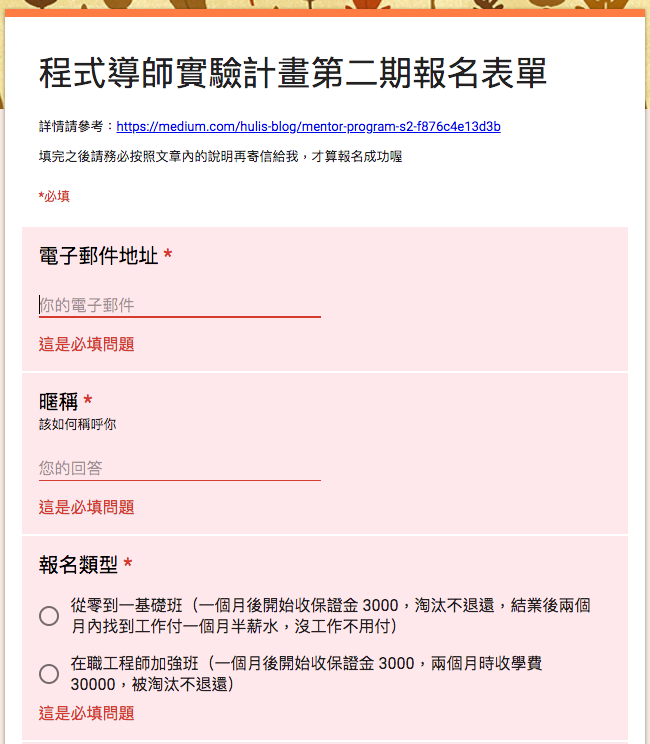

# 作業

## hw1：計算機


可參考範例：[https://lidemy.github.io/mentor-program-kristxeng/homeworks/week4/hw1/](https://lidemy.github.io/mentor-program-kristxeng/homeworks/week4/hw1/)（第一期學生 Kris 的作品）

請用你在之前學會的網頁技術（HTML, CSS, JavaScript）打造出一個簡單的計算機，功能如下：

1. 要有 0 到 9
2. 要有加減乘除
3. 要能夠清空

計算機這一題其實要難可以到很難，這個作業的目的只是想讓你熟悉基本操作而已，所以你可以用以下的範例來測試，能夠通過就好：

### 測試1

1. 按下 123
2. 按下 +
2. 按下 456
3. 按下 =
4. 出現 579

### 測試2

1. 按下 20
2. 按下 -
2. 按下 25
3. 按下 =
4. 出現 -5

## hw2：仿 Google 表單

請實作出你們當初報名時所填寫的表單：https://docs.google.com/forms/d/e/1FAIpQLSeOTy7j1OjgI-q9xYaiGCJJn5w2TkpB1JNZZXXQwqCt3SsDsg/viewform



可參考範例：[https://lidemy.github.io/mentor-program-pychiang/homeworks/week4/hw2/](https://lidemy.github.io/mentor-program-pychiang/homeworks/week4/hw2/)（第一期學生 pychiang 的作品）

背景隨便用一個顏色就好了，重點是實做出表單內容以及驗證。UI 可以不用完全一樣，只要功能有做出來就好，UI 只是讓你參考的。

功能如下：

1. 文字輸入框可以選擇必填或是非必填
2. 送出表單時，必填的地方如果空白，要能夠把背景變紅色並且提示使用者
3. 成功提交之後，把表單的資料輸出在 console，並且用`alert`跳出提示即可

## hw3：仿 Twitch 頻道頁面

請串接 [Twitch API v5](https://dev.twitch.tv/docs/v5/)，顯示出 League of Legends 目前正在直播的前 20 個實況。


1. [Twitch API](https://dev.twitch.tv/docs/v5/)裡面有一個 API 是可以拿到現在正在直播的某個遊戲底下的資料，API 的描述是「Gets a list of live streams.」，看到這行就代表你找對 API 了。
2. API 要帶的參數有一個 `game` 的欄位，請帶`League%20of%20Legends`
3. 請顯示 20 個實況，不多不少，要剛好 20 個

（基本上這題就是直接照搬我之前在別的地方出過的[作業](https://github.com/aszx87410/frontend-intermediate-course/blob/master/homeworks/hw4.md)）

## hw4：化繁為簡

每次在操縱 DOM 物件時，都需要輸入`document.querySelector()`，重複幾次之後會覺得有點煩瑣，所以我們可以實作出一個簡單的 function 叫做`q`，可以快速的選取到你要的元素，接著利用選到之後的這個物件進行常見的操作（`hide`跟`show`）

可以參考以下範例，只要能夠按照以下範例運行即可：

``` js
var element = q('.title')
element.hide() // 隱藏
element.show() // 顯示 

```
## hw5：簡答題

1. 什麼是 DOM？
2. 什麼是 Ajax？
3. HTTP method 有哪幾個？有什麼不一樣？
4. `GET` 跟 `POST` 有哪些區別，可以試著舉幾個例子嗎？
5. 什麼是 RESTful API？
6. JSON 是什麼？
7. JSONP 是什麼？
8. 要如何存取跨網域的 API？
